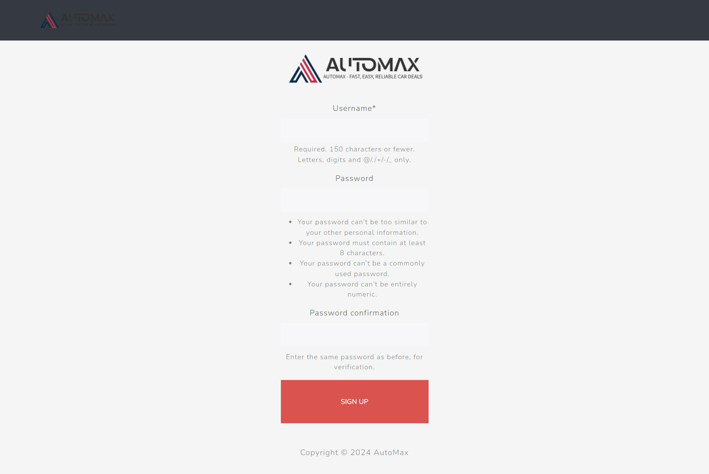
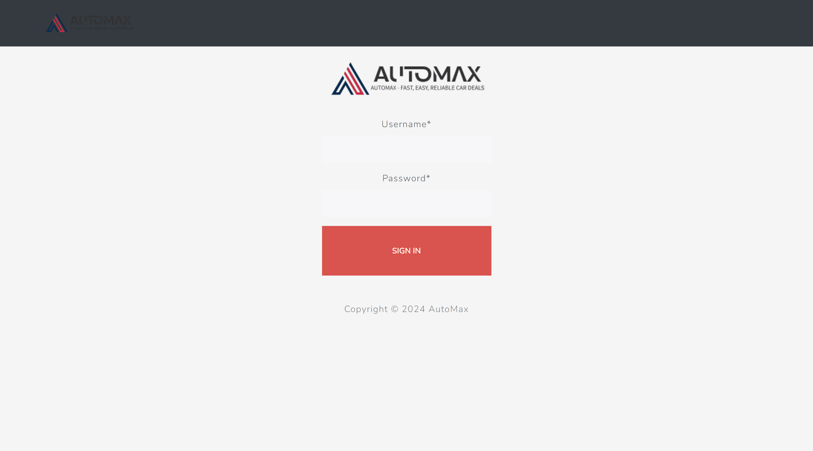
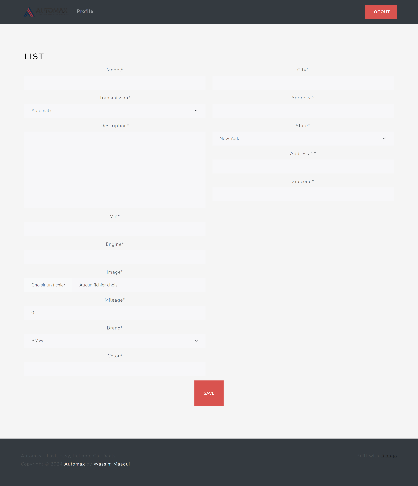
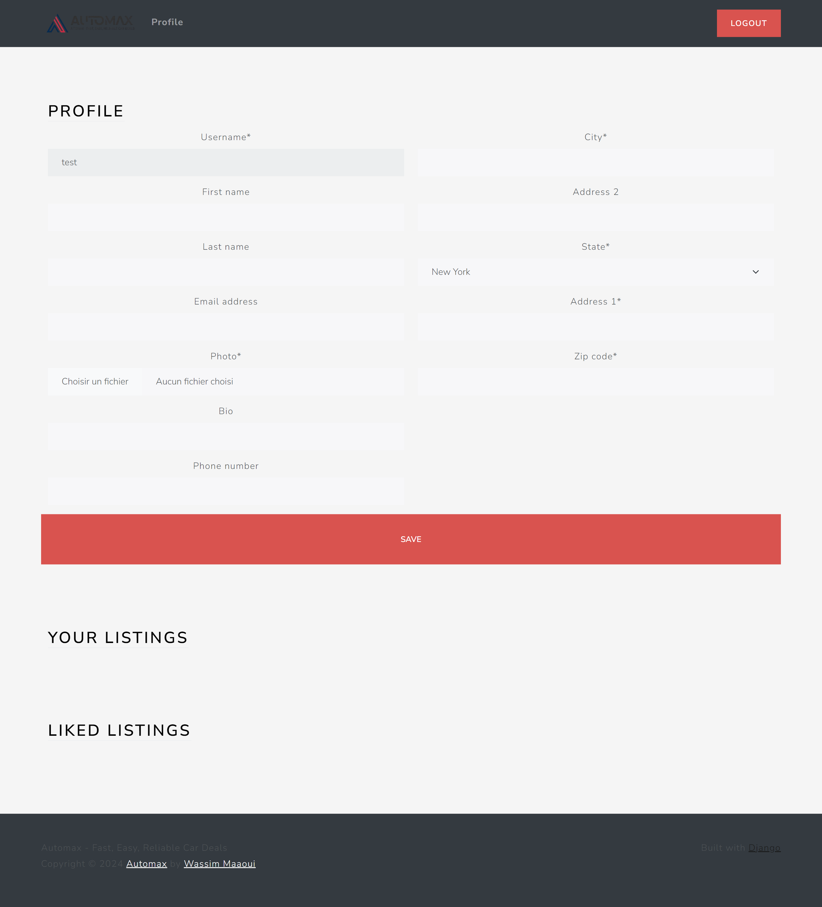

# Automax: A Car Marketplace

Automax is a web application designed to enhance the car buying and selling experience. It offers a user-friendly platform for individuals to discover their dream cars or sell their own cars.

## Table of contents

- [Automax: A Car Marketplace](#automax-a-car-marketplace)
  - [Table of contents](#table-of-contents)
  - [Overview](#overview)
    - [Functionalities](#functionalities)
    - [Screenshot](#screenshot)
  - [My process](#my-process)
    - [Built with](#built-with)
  - [Note](#note)
  - [Author](#author)

## Overview

### Functionalities

Users can:

- Create a new account.
- Log in using their credentials.
- Logout.
- Manage their profile.
  - Update personal information.
  - View personal car listings.
- Manage their car listings.
  - Create new offer.
  - Update existing offer.
  - Filter available offers to find the right match.

### Screenshot

MAIN SCREEN

SIGN UP SCREEN

SIGN IN SCREEN

HOME SCREEN

CREATE NEW OFFER SCREEN

PROFILE SCREEN

## My process

### Built with

- **Frontend:**
  - Django ([https://www.djangoproject.com/])
- **Backend:**
  - Django ([https://www.djangoproject.com/])

## Note

This project was created as a practical exercise to reinforce Django fundamentals. It serves as a foundational example for those interested in building web applications with Django.

*Course Reference*: [Python Django: The Complete Django Web Development Course](https://www.udemy.com/course/python-django-the-complete-django-web-development-course/)

## Author

- Frontend Mentor - [@wess-MHHW](https://www.frontendmentor.io/profile/wess-MHHW)
- LeetCode - [@wess-MHHW](https://leetcode.com/wess-MHHW/)
- Linkedin - [@wassim-maaoui](https://www.linkedin.com/in/wassim-maaoui/)
